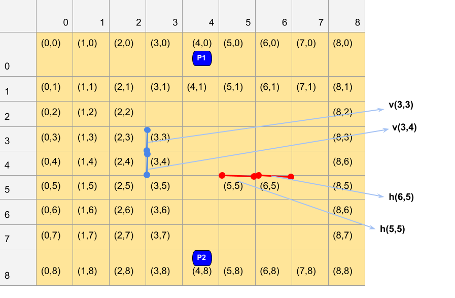

# **A Python Implementation of the Board Game, Quoridor**

##### _Rules of Quoridor:_
The rules can be read from the following .pdf:

https://en.gigamic.com/files/media/fiche_pedagogique/educative-sheet_quoridor-english.pdf

This video also explains the rules of Quoridor:

https://www.youtube.com/watch?v=6ISruhN0Hc0

##### _How to play in Console:_
_Moving the pawn:_ 

The move_pawn() method must be used to move a player's pawn. 
move_pawn() takes two parameters:
  - The number of the players: 1 or 2 
  - the position that player would like their pawn moved to: (x, y)

_Placing a fence:_

the place_fence() method must be used to place a fence on the game board.
place_fence() takes three parameters: 
  - The number of the player placing the fence: 1 or 2
  - The orientation that fence will be placed on the board as a string: "v" or "h"
  - The position on the board that the fence will be placed: (x, y)

The following image shows how the board is being represented in this program:

The print_board() method will print the current board state out to the console.

# **What I've Learned**
  - Manipulating Python built in data structures (in this case, lists) to solve real world problem such as a game
  - Representing the data in human readable form (see __str__ method)
  - Efficient and effective design techniques to implement a fully functioning game board in Python3.
